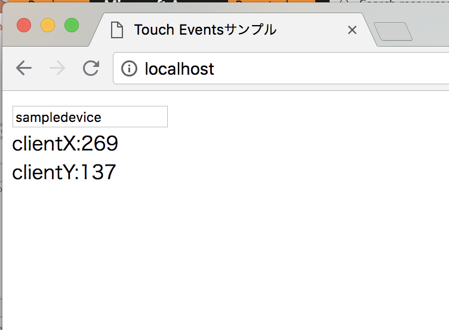
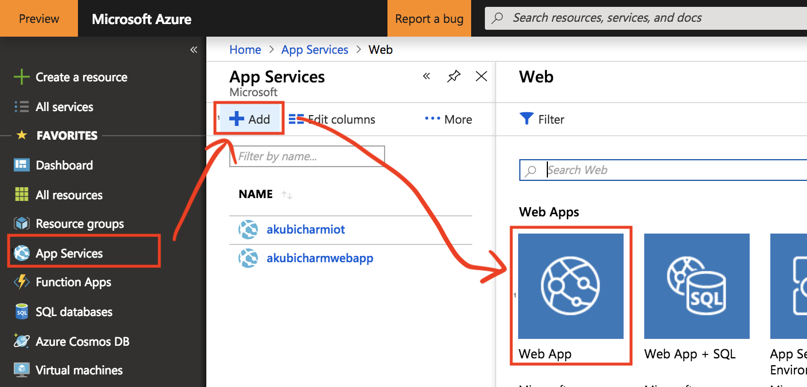

# IoT デモで使えるWeb Client (Python Flask版)

IoT Hub SDK (Python版）を利用して、WebアプリケーションからIoT HubにJSON形式でメッセージを送信するアプリケーションです。

アプリケーションのコンテナイメージは、Docker Hubで後悔しているので、Azure Web Appsやローカルで実行可能です。

## アプリケーション
### Touch Event

マウスカーソルまたは、タブレットやスマホでのタッチイベントを検知して、X, Y 座標とタイムスタンプをIoT Hubに送信します。

* コンテキストルート
```
http://[ホスト名]/touchevent
```
* 送信するメッセージ
```
{"x":564,"y":257,"timestamp":"2018-10-02T11:22:52.282Z","deviceName":"sampledevice"}
```

## 参考
* https://pypi.org/project/azure-iothub-device-client/
* https://docs.microsoft.com/ja-jp/azure/iot-hub/iot-hub-device-sdk-platform-support


## IoT Hubの準備

1. Azure Portal で Azure IoT Hubを作成します。
1. Azure IoT Hubのポータルで IoT Deviceを追加します。
 1. 左側のメニューからExplorersカテゴリの **IoT devices** を選択します。
 1. 右側のペイン上部の「+Add」をクリックします。
 1. デバイス作成画面でDevice IDを入力し「Save」をクリックします。
1. IoT devicesの一覧から作成されたデバイスを選択します。
1. デバイスの詳細画面で接続文字列 **Connection String(primary key)**をコピーしておきます。


## ローカルでの実行

Docker Hubで公開しているイメージを利用してローカルで実行する場合は、次のコマンドを実行します。

IoT Hubへの接続文字列を環境変数として設定するので、docker コマンドの -e オプションで環境変数で設定します。
```
export CONNECTION_STRING="IoT Hubの準備でコピーしておいた接続文字列"
docker run -it -p 80:80 -e CONNECTION_STRING=$CONNECTION_STRING akubicharm/iot-webapp-python
```

* -p オプション
 * コンテナの80番ポートを、ローカルの80番ポートにポートマッピングします。
* -e オプション
 * コンテナに環境変数としてIoT Hubの接続文字列を指定します。

`http://localhost/`に接続して動作を確認します。


## Azure Web Appでの実行

1. Azure Portalの左側のメニューで**App Services**を選択します。
1. App Serviceのビューの上部の「+Add」をクリックします。
1. App Serviceの選択画面で**Web App**を選択します。

1. Web Appの詳細画面の下部の「Create」をクリックします。
1. Web Appの作成ダイアログで必要なパラメータを入力して、「Create」をクリックします。

|設定項目|設定値|
|---|---|
|App name|任意の名称。ただし、Azure全体で一意のFQDNになるようにする|
|Subscription|利用するサブスクリプション|
|Resource Group|Create newで新しいリソースグループを作成するか、既存のリソースグループを選択|
|OS|Linux|
|Publish|Docker image|
|App Service plan/Location|クリックして表示される右側のペインから選択|
|Configure Container|クリックして詳細ダイアログを表示|
|コンテナ技術の選択|Single Container|
|Image source|Docker Hub|
|Repository Access|Public|
|Image and optional tag|akubicharm/iot-webapp-python:latest|

作成したAzure Web Appの詳細画面に表示されたURLをコピーして、プロトコルをhttpsからhttpに変更してブラウザで開きます。


## コンテナイメージの作成

Docker Hubからコンテナイメージをpullして利用する場合は、このステップは飛ばしてください。

### ビルド
Dockerfileの配置されているディレクトリに移動して、次のコマンドを実行します。
```
docker build --rm -t iot-webapp-python .
```
